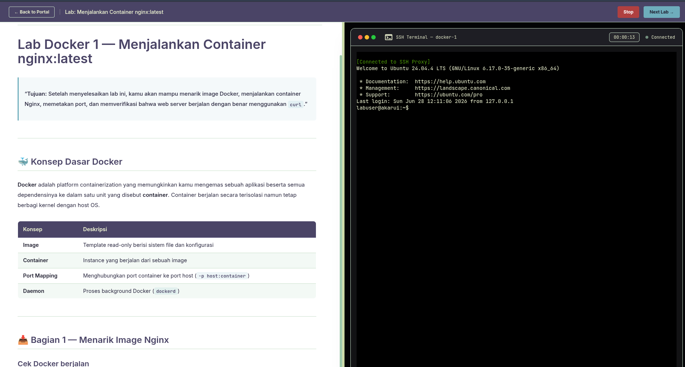

# Lab Docker 1 — Menjalankan Container nginx:latest

> **Tujuan:** Setelah menyelesaikan lab ini, kamu akan mampu menarik image Docker, menjalankan container Nginx, memetakan port, dan memverifikasi bahwa web server berjalan dengan benar menggunakan `curl`.

---

## 🐳 Konsep Dasar Docker

**Docker** adalah platform containerization yang memungkinkan kamu mengemas sebuah aplikasi beserta semua dependensinya ke dalam satu unit yang disebut **container**. Container berjalan secara terisolasi namun tetap berbagi kernel dengan host OS.

| Konsep                 | Deskripsi                                                         |
| ---------------------- | ----------------------------------------------------------------- |
| **Image**        | Template read-only berisi sistem file dan konfigurasi             |
| **Container**    | Instance yang berjalan dari sebuah image                          |
| **Port Mapping** | Menghubungkan port container ke port host (`-p host:container`) |
| **Daemon**       | Proses background Docker (`dockerd`)                            |

---

## 📥 Bagian 1 — Menarik Image Nginx

### Cek Docker berjalan

```bash
docker --version
docker info | grep "Server Version"
```

### Pull Image dari Docker Hub

```bash
docker pull nginx:latest
```

Output yang diharapkan:

```
latest: Pulling from library/nginx
...
Status: Downloaded newer image for nginx:latest
docker.io/library/nginx:latest
```

### Verifikasi image berhasil diunduh

```bash
docker images | grep nginx
```

Output:

```
REPOSITORY   TAG       IMAGE ID       CREATED        SIZE
nginx        latest    a72860cb95fd   2 weeks ago    192MB
```

---

## 🚀 Bagian 2 — Menjalankan Container Nginx

### Jalankan Container

```bash
docker run -d \
  --name my-nginx \
  -p 8080:80 \
  nginx:latest
```

**Penjelasan flag:**

| Flag                | Fungsi                                              |
| ------------------- | --------------------------------------------------- |
| `-d`              | Detached mode — container berjalan di background   |
| `--name my-nginx` | Memberi nama container agar mudah direferensikan    |
| `-p 8080:80`      | Memetakan port 8080 di host ke port 80 di container |
| `nginx:latest`    | Image yang digunakan                                |

### Cek Container Berjalan

```bash
docker ps
```

Output yang diharapkan:

```
CONTAINER ID   IMAGE          COMMAND                  CREATED         STATUS         PORTS                  NAMES
a1b2c3d4e5f6   nginx:latest   "/docker-entrypoint.…"   5 seconds ago   Up 4 seconds   0.0.0.0:8080->80/tcp   my-nginx
```

---

## 🌐 Bagian 3 — Verifikasi dengan curl

### Test HTTP Response

```bash
curl -s http://localhost:8080
```

Output yang diharapkan (Nginx default page):

```html
<!DOCTYPE html>
<html>
<head>
<title>Welcome to nginx!</title>
...
```

### Cek Response Headers

```bash
curl -I http://localhost:8080
```

Output:

```
HTTP/1.1 200 OK
Server: nginx/1.27.0
Date: Sat, 28 Jun 2025 09:00:00 GMT
Content-Type: text/html
Content-Length: 615
Connection: keep-alive
```

### Verifikasi Status Code 200

```bash
curl -o /dev/null -s -w "HTTP Status: %{http_code}\n" http://localhost:8080
```

Output:

```
HTTP Status: 200
```

---

## 📋 Bagian 4 — Inspeksi Container

### Lihat Log Nginx

```bash
docker logs my-nginx
```

### Inspeksi Detail Container

```bash
docker inspect my-nginx | grep -A5 '"Ports"'
```

### Masuk ke Shell Container

```bash
docker exec -it my-nginx /bin/bash
```

Di dalam container, kamu bisa mengeksplorasi:

```bash
# Lihat konfigurasi nginx
cat /etc/nginx/nginx.conf

# Lihat direktori web root
ls /usr/share/nginx/html/

# Keluar dari container
exit
```

---

## 🛑 Bagian 5 — Mengelola Container

### Stop Container

```bash
docker stop my-nginx
```

### Start Kembali

```bash
docker start my-nginx
```

### Restart Container

```bash
docker restart my-nginx
```

### Hapus Container (harus stop dulu)

```bash
docker stop my-nginx
docker rm my-nginx
```

### Hapus Image

```bash
docker rmi nginx:latest
```

---

## 🧪 Latihan Mandiri

Coba jalankan dua instance Nginx secara bersamaan pada port berbeda:

```bash
# Instance pertama di port 8081
docker run -d --name nginx-1 -p 8081:80 nginx:latest

# Instance kedua di port 8082
docker run -d --name nginx-2 -p 8082:80 nginx:latest

# Cek keduanya berjalan
docker ps

# Verifikasi keduanya merespons
curl -s -o /dev/null -w "nginx-1 status: %{http_code}\n" http://localhost:8081
curl -s -o /dev/null -w "nginx-2 status: %{http_code}\n" http://localhost:8082

# Cleanup
docker stop nginx-1 nginx-2
docker rm nginx-1 nginx-2
```

---

## ✅ Kriteria Keberhasilan

Pastikan kamu sudah berhasil:

| Tugas                  | Perintah                                  |
| ---------------------- | ----------------------------------------- |
| Pull image             | `docker pull nginx:latest`              |
| Jalankan container     | `docker run -d -p 8080:80 nginx:latest` |
| Cek container running  | `docker ps`                             |
| Verifikasi HTTP 200    | `curl http://localhost:8080`            |
| Lihat log container    | `docker logs my-nginx`                  |
| Stop & hapus container | `docker stop && docker rm`              |

> 💡 **Tips:** Gunakan `docker ps -a` untuk melihat **semua** container termasuk yang sudah berhenti. Gunakan `docker system prune` untuk membersihkan semua resource Docker yang tidak terpakai!
